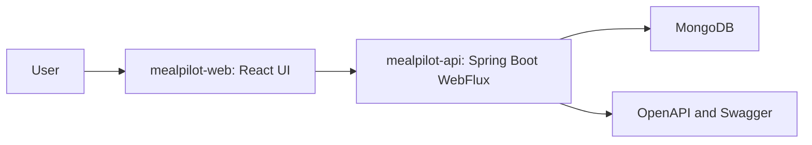
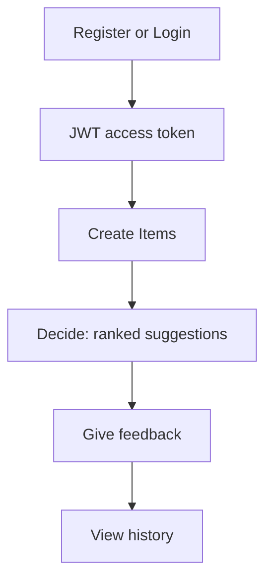

# MealPilot

MealPilot is a **decision-first food ordering assistant**.

Instead of browsing endlessly, you provide minimal input (budget, tags, query) and get **1–3 ranked “ready-to-order” suggestions** with **confidence + reasons**. Your feedback (accept/reject + reason) teaches the system over time.

## Problem statement

Food apps are great at showing options, but they often make the user do the hardest part: **deciding**.

Common pain points:

- Too many choices → decision fatigue
- Repeating the same filtering every time (budget, cravings, dietary needs)
- No “learning loop” from your accept/reject feedback
- You waste time browsing instead of ordering

## Solution overview

MealPilot focuses on the decision step:

- You store your go-to meals (“Items”) once
- You request a decision with minimal inputs (budget, query, tags)
- The system returns **ranked candidates** with **reasons + confidence**
- Your feedback becomes signals for better future decisions

## Key features (and why they’re useful)

- **JWT auth + user isolation**: each user has their own items, decisions, and preferences
- **Items library**: save your favorite meals with tags and platform hints
- **Decide**: returns ranked suggestions with explainability (reasons/confidence)
- **Feedback loop**: accept/reject and reasoning are stored to improve future suggestions
- **History + pagination**: review past decisions and outcomes
- **Preferences**: store user-level preference signals to influence decisions
- **Deep links**: one-click “ready to order” via platform links (e.g., Swiggy/Zomato/EatSure)
- **Dev UI**: fast workflow to test the full product loop end-to-end

## Feature implementation details (high level)

Backend (Spring Boot WebFlux + Reactive MongoDB):

- **Reactive controllers** for auth/items/decide/history/preferences
- **Security** via Spring Security OAuth2 Resource Server (JWT)
  - Public routes bypass JWT filters
  - Protected `/api/**` routes require `Authorization: Bearer <jwt>`
- **Request pipeline utilities**: request id + rate limiting filters (where enabled)
- **Persistence**: reactive repositories backed by MongoDB collections
- **OpenAPI**: live schema available for Swagger UI and client generation

Frontend (React + TypeScript + Vite):

- **React Router** for screens and routing
- **Zustand (persisted)** for session/token + backend URL settings
- **TanStack Query** for server state (items, decisions, preferences)
- **API client guardrails**: avoids attaching `Authorization` to public auth endpoints
- **Responsive UI shell**: desktop sidebar + mobile bottom nav

## Architecture

At a glance:

Main components:

- **mealpilot-web**: UI, session handling, API calls, responsive layout
- **mealpilot-api**: auth (JWT), business logic for items/decisions/preferences/history
- **MongoDB**: stores users, items, decisions, feedback, preferences

## Workflow / flow (end-to-end)

Typical user journey:

## STAR method explanation (project summary)

- **Situation**: Users waste time browsing food apps and struggle to pick “what to eat” quickly.
- **Task**: Build a decision-first assistant that reduces choice overload and gets users to a ready-to-order suggestion fast.
- **Action**:
  - Implemented a reactive backend with JWT security, items storage, decision generation, and feedback capture.
  - Built a responsive React UI with a guided flow (Auth → Items → Decide → Feedback → History).
  - Added explainability (reasons/confidence) and deep links to go from decision to ordering.
- **Result**: A working end-to-end system that turns a few inputs into ranked meal suggestions, persists learning signals, and supports repeatable decision-making with history and preferences.

## Project layout

- `mealpilot-api/` — Spring Boot 3 / Java 21 reactive API (WebFlux + Reactive MongoDB)
- `mealpilot-web/` — React + TypeScript dev UI (Vite)

## Core workflow (end-to-end)

1. Register

- `POST /api/auth/register`

2. Login (get JWT)

- `POST /api/auth/login` → `accessToken`

3. Create items (your go-to meals)

- `POST /api/items`
- `GET /api/items`

4. Decide

- `POST /api/decide` → returns 1–3 ranked candidates and a `decisionId`

5. History

- `GET /api/decisions` supports cursor pagination (see `X-Next-Cursor` response header)

6. Feedback (learning loop)

- `POST /api/decisions/{id}/feedback`

## Security model

- Public endpoints:
  - `GET /` (HTML in browser; JSON if `Accept: application/json`)
  - `GET /api/health`
  - `GET /actuator/health`, `GET /actuator/info`
  - `POST /api/auth/register`, `POST /api/auth/login`
  - OpenAPI/Swagger:
    - `GET /v3/api-docs`
    - `GET /swagger-ui.html` (redirects to Swagger UI)
    - `GET /swagger-ui/**`
- Everything else requires: `Authorization: Bearer <jwt>`

## Run locally (Windows)

Prereqs:

- JDK 21
- MongoDB listening at `mongodb://localhost:27017/mealpilot` (see options below)

### Option A) Start MongoDB via Docker (recommended)

From repo root:

- `docker compose up -d`

### Option B) Use your local MongoDB install

Ensure MongoDB is running locally and accessible at `mongodb://localhost:27017/mealpilot`.

### 1) Start backend (fixed port)

From repo root (recommended):

- `powershell -NoProfile -ExecutionPolicy Bypass -File run-dev.ps1`

Or backend only:

- `cd mealpilot-api`
- `powershell -NoProfile -ExecutionPolicy Bypass -File .\run-dev.ps1`

Backend URL (default): `http://localhost:9000`

### 2) Start frontend

- `cd mealpilot-web`
- `npm install`
- `npm run dev`

Open:

- http://127.0.0.1:5173/

If you changed backend port, paste the backend base URL into Settings (it’s remembered in localStorage).

### 3) Generate typed API client (frontend)

With the backend running, generate TypeScript types from the live OpenAPI schema:

- `cd mealpilot-web`
- `npm run api:gen`

This writes: `mealpilot-web/src/gen/api-types.ts`.

## Repo structure

- `mealpilot-api/`: Spring Boot WebFlux API + OpenAPI
- `mealpilot-web/`: React/Vite frontend
- `docker-compose.yml`: local dependencies (MongoDB, etc.)
- `run-dev.ps1`: convenience script for local dev

## Notes

- Port `8080` is commonly occupied on Windows (e.g., Jenkins service). MealPilot defaults to `9000` to avoid conflicts.
- The React UI is a dev UI intended to exercise the full flow quickly.

## Full product idea

See [MEALPILOT.md](MEALPILOT.md) for the detailed product idea, UX principles, and longer-term roadmap.
